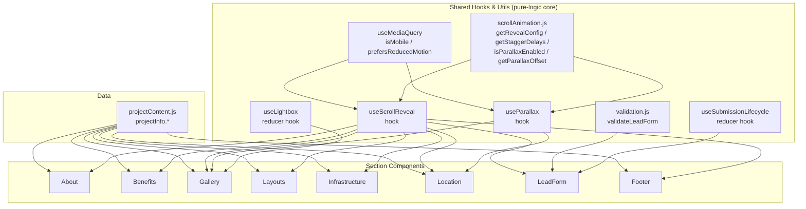

# Design Document

## Overview

Восемь секций-заглушек лендинга HOLDING (`About`, `Benefits`, `Gallery`, `Layouts`, `Infrastructure`, `Location`, `LeadForm`, `Footer`) должны получить реальный контент из `projectInfo` и согласованные скролл-анимации на базе GSAP ScrollTrigger, в стиле уже реализованного `CinematicStory`.

Ключевая инженерная задача — не переписать одну и ту же ScrollTrigger-инициализацию восемь раз, а выделить общий, переиспользуемый и корректный по своим свойствам слой анимационной логики (reveal-on-scroll, stagger, parallax, reduced-motion, mobile-adaptation), поверх которого секции остаются простыми презентационными компонентами. Второй по значимости блок — модель данных: `projectContent.js` расширяется четырьмя новыми полями (`layouts`, `infrastructure`, `location`, `footer`) со строгими контрактами полей. Третий блок — `LeadForm` с чистой функцией валидации и явным жизненным циклом отправки (idle → submitting → success/error).

Дизайн разделяет код на три слоя:
1. **Чистые утилиты/хуки** (`src/utils/scrollAnimation.js`, `src/utils/validation.js`, `src/hooks/*`) — вся логика, которая поддаётся property-based тестированию без DOM.
2. **Презентационные секции** (`src/components/*.jsx`) — используют хуки, содержат JSX и Tailwind-классы бренд-темы.
3. **Данные** (`src/data/projectContent.js`) — расширенный `projectInfo` с задокументированной схемой через JSDoc-типы.

## Architecture



### Design decisions

- **Single reusable reveal hook instead of per-section ScrollTrigger boilerplate.** `useScrollReveal` wraps `useGSAP` + `ScrollTrigger.create`, mirroring the cleanup pattern already established in `CinematicStory.jsx` (`return () => st.kill()`), and is the *only* place that creates/destroys ScrollTriggers for the seven "simple" sections. This satisfies Requirement 11 (one ScrollTrigger set per mount, cleaned up on unmount) by construction rather than by discipline in each component.
- **Pure decision/calculation functions separated from DOM effects.** Everything that has a "for all inputs" correctness shape (reveal bounds, stagger delay spacing, parallax offset math, parallax enablement, form validation, submission-state transitions, contact link building, data-schema validation) lives in plain functions in `src/utils/` with no GSAP/DOM dependency, so they can be property-tested directly in Node without a browser or GSAP mocks.
- **`prefers-reduced-motion` and mobile viewport are read once via `useMediaQuery`** (wrapping `window.matchMedia`) and threaded into the pure decision functions, rather than re-implemented per section.
- **GSAP/ScrollTrigger/Lenis stack is kept as-is** — no new animation library is introduced. `@gsap/react`'s `useGSAP` is reused (already a dependency and already used for the Lenis wiring in `App.jsx`).
- **LeadForm submission is decoupled from the UI via an injectable `onSubmit` prop** defaulting to a stub that resolves after a simulated delay. This keeps the form fully testable and leaves a clear seam for wiring a real backend endpoint later — see the security note in Error Handling.

## Components and Interfaces

### `src/utils/scrollAnimation.js` (pure, no DOM)

```js
/**
 * @param {boolean} reducedMotion
 * @returns {{ from: { opacity: number, y: number }, to: { opacity: number, y: number }, duration: number }}
 */
export function getRevealConfig(reducedMotion, { y = 30 } = {}) { /* ... */ }

/**
 * @param {number} count
 * @param {number} [maxDelayMs=200]
 * @returns {number[]} delay in ms for the item at each index, index 0 === 0
 */
export function getStaggerDelays(count, maxDelayMs = 200) { /* ... */ }

/**
 * @param {boolean} isMobile
 * @param {boolean} reducedMotion
 * @returns {boolean}
 */
export function isParallaxEnabled(isMobile, reducedMotion) { /* ... */ }

/**
 * @param {number} progress current scroll progress of the section, 0..1
 * @param {number} amplitude max pixel offset
 * @returns {number} pixel offset, always within [-amplitude, amplitude]
 */
export function getParallaxOffset(progress, amplitude) { /* ... */ }

/**
 * Pure state machine for repeatable enter/exit reveal triggering.
 * @param {'idle'|'revealed'} state
 * @param {number} visibleRatio current visible-height ratio of the section, 0..1
 * @param {number} [threshold=0.2]
 * @returns {{ state: 'idle'|'revealed', shouldPlay: boolean }}
 */
export function nextRevealState(state, visibleRatio, threshold = 0.2) { /* ... */ }
```

### `src/hooks/useMediaQuery.js`

```js
export function useMediaQuery(query) // returns boolean, updates on change
export function useIsMobile() // useMediaQuery('(max-width: 767px)')
export function usePrefersReducedMotion() // useMediaQuery('(prefers-reduced-motion: reduce)')
```

### `src/hooks/useScrollReveal.js`

Encapsulates the ScrollTrigger boilerplate for a section, following the `CinematicStory` pattern (register plugin once at module scope, create in `useGSAP`/`useEffect`, kill on cleanup).

```js
/**
 * @param {React.RefObject} sectionRef - trigger element
 * @param {object} options
 * @param {React.RefObject[]} [options.itemRefs] - if provided, staggers these instead of animating sectionRef as one block
 * @param {number} [options.maxStaggerDelayMs=200]
 * @param {number} [options.y=30]
 * @returns {void}
 */
export function useScrollReveal(sectionRef, options) { /* ... */ }
```

Internally: reads `usePrefersReducedMotion()`; if true, sets final state via `getRevealConfig(true)` immediately and creates **no** ScrollTrigger (satisfying Req 11.5 — no parallax/scroll-driven animation while reduced motion is active). Otherwise creates one `ScrollTrigger` with `start: 'top 80%'` (≈20% visibility heuristic), `toggleActions: 'play none none none'` won't re-fire on scroll back up, so `onEnterBack` and `onLeave`/`onLeaveBack` callbacks are wired explicitly and delegate to `nextRevealState` to decide whether to replay — this is what makes Req 1.3's re-trigger-after-dropping-below-threshold behavior testable via the pure `nextRevealState` function. Stagger delays for `itemRefs` come from `getStaggerDelays`.

### `src/hooks/useParallax.js`

```js
/**
 * @param {React.RefObject} sectionRef
 * @param {React.RefObject} targetRef - element to translate
 * @param {number} [amplitude=60] max pixel travel
 */
export function useParallax(sectionRef, targetRef, amplitude) { /* ... */ }
```

Reads `useIsMobile()` and `usePrefersReducedMotion()`, gates ScrollTrigger creation with `isParallaxEnabled`. On `onUpdate`, sets `targetRef.current` transform using `getParallaxOffset(self.progress, amplitude)`.

### `src/hooks/useLightbox.js`

```js
/**
 * @returns {{ openIndex: number | null, open: (index: number) => void, close: () => void }}
 */
export function useLightbox() { /* ... */ }
```

Backed by the pure reducer `lightboxReducer(state, action)` (`{type:'OPEN', index}` / `{type:'CLOSE'}`) so it is directly property-testable independent of React.

### `src/utils/validation.js` (pure)

```js
/**
 * @param {{ name: string, phone: string, consent: boolean }} formData
 * @returns {{ valid: boolean, errors: { name?: string, phone?: string, consent?: string } }}
 */
export function validateLeadForm(formData) { /* ... */ }
```

Rules encoded here: name/phone required (non-empty after trim, name ≤100 chars enforced at input `maxLength` + re-validated), phone stripped of spaces/`-`/`()`/`+` must be 10–15 digits and only digits, consent must be `true`.

### `src/hooks/useSubmissionLifecycle.js`

```js
/**
 * @param {(formData) => Promise<void>} onSubmit
 * @returns {{ status: 'idle'|'submitting'|'success'|'error', submit: (formData) => Promise<void>, reset: () => void }}
 */
export function useSubmissionLifecycle(onSubmit) { /* ... */ }
```

Backed by pure reducer `submissionReducer(state, action)` with actions `SUBMIT_START`, `SUBMIT_SUCCESS`, `SUBMIT_ERROR`, `RESET`, enforcing: no `SUBMIT_START` accepted while already `submitting` (Req 7.8), `SUBMIT_SUCCESS` clears stored form data (Req 7.6), `SUBMIT_ERROR` retains it (Req 7.7).

### `src/utils/links.js` (pure)

```js
/** @returns {string} e.g. "tel:+79991234567" */
export function buildTelHref(phone) { /* ... */ }
/** @returns {string} e.g. "mailto:info@holding.ru" */
export function buildMailHref(email) { /* ... */ }
```

### Section components

All seven non-form sections follow the same shape (About shown; others are structurally identical, differing only in the data field and card layout):

```jsx
// src/components/About.jsx
import { useRef } from 'react';
import { useScrollReveal } from '../hooks/useScrollReveal';
import { projectInfo } from '../data/projectContent';

export default function About() {
  const sectionRef = useRef(null);
  useScrollReveal(sectionRef);
  return (
    <section id="about" ref={sectionRef} className="...">
      <p>{projectInfo.about}</p>
    </section>
  );
}
```

- **Benefits**: maps `projectInfo.benefits`, passes an array of card refs to `useScrollReveal({ itemRefs })`; renders nothing when array is empty (Req 2.3).
- **Gallery**: maps `projectInfo.gallery`; each image wrapped for `useParallax` (per-item amplitude, disabled on mobile/reduced-motion); click opens `useLightbox().open(index)`; `Lightbox` sub-component renders fixed overlay, closes on backdrop click, close-button click, or `Escape` keydown listener; renders nothing when array is empty (Req 3.7).
- **Layouts**: maps `projectInfo.layouts`; if empty renders a "нет доступных планировок" message instead (Req 4.4); card shows type, area (`м²`), rooms, image.
- **Infrastructure**: maps `projectInfo.infrastructure`; empty → "нет данных об инфраструктуре" message (Req 5.4); card shows category, name, formatted distance (`{value} {unit}`).
- **Location**: renders `projectInfo.location.address`, maps `landmarks` (omits list entirely if empty, Req 6.5), background/map element wrapped with `useParallax`.
- **Footer**: renders `buildTelHref`/`buildMailHref` anchors and `legalText`.
- **LeadForm**: controlled inputs (`name`, `phone`, `consent`) + `useSubmissionLifecycle(onSubmit)` + `validateLeadForm`; on submit, runs validation, sets field errors from `errors`, otherwise calls `submit(formData)`; submit button `disabled={status === 'submitting'}` (Req 7.8); success renders confirmation and clears inputs; error renders message and keeps inputs; `useScrollReveal` staggers the fields.

## Data Models

Extending `src/data/projectContent.js`. Existing `about`, `benefits`, `gallery` keys are unchanged; four new keys are added to `projectInfo`, documented with JSDoc typedefs for editor/type support (project uses `@types/react` but no runtime type system, so validation of these shapes at the *data* level is enforced by the `Data Contract Validation` correctness property rather than by TypeScript).

```js
/**
 * @typedef {Object} LayoutItem
 * @property {string} type        - e.g. "Студия", "1-комнатная"
 * @property {number} area         - m², > 0
 * @property {number} rooms        - integer >= 0 (0 = studio)
 * @property {string} image        - path/URL to floor plan image
 *
 * @typedef {Object} Distance
 * @property {number} value        - > 0
 * @property {'m'|'min'} unit
 *
 * @typedef {Object} InfrastructureItem
 * @property {string} category     - non-empty, e.g. "Образование"
 * @property {string} name         - non-empty, e.g. "Школа №12"
 * @property {Distance} distance
 *
 * @typedef {Object} Landmark
 * @property {string} name         - non-empty
 * @property {Distance} distance
 *
 * @typedef {Object} LocationInfo
 * @property {string} address      - non-empty
 * @property {{ lat: number, lng: number }} coordinates
 * @property {Landmark[]} landmarks
 * @property {string} [backgroundImage]
 *
 * @typedef {Object} FooterInfo
 * @property {string} phone        - e.g. "+7 999 123-45-67"
 * @property {string} email        - e.g. "info@holding.ru"
 * @property {string} legalText
 */

export const projectInfo = {
  about: /* unchanged */,
  benefits: /* unchanged */,
  gallery: /* unchanged */,
  /** @type {LayoutItem[]} */
  layouts: [ /* ... */ ],
  /** @type {InfrastructureItem[]} */
  infrastructure: [ /* ... */ ],
  /** @type {LocationInfo} */
  location: { address: '...', coordinates: { lat: 0, lng: 0 }, landmarks: [ /* ... */ ] },
  /** @type {FooterInfo} */
  footer: { phone: '...', email: '...', legalText: '...' },
};
```

Corresponding pure validators live in `src/utils/contentSchema.js` (`isValidLayoutItem`, `isValidInfrastructureItem`, `isValidLocationInfo`, `isValidFooterInfo`) — used by the Data Contract Validation property and optionally at module load in dev mode to warn on malformed content.

## Correctness Properties

*A property is a characteristic or behavior that should hold true across all valid executions of a system-essentially, a formal statement about what the system should do. Properties serve as the bridge between human-readable specifications and machine-verifiable correctness guarantees.*

### Property 1: Entrance reveal configuration is bounded and respects motion preference

*For any* boolean `reducedMotion` and any vertical offset parameter, `getRevealConfig(reducedMotion)` SHALL return a `from` state with `opacity === 0` and a `to` state with `opacity === 1` when `reducedMotion` is `false`, a `duration` of at most 1000ms, and a `y` offset (absolute value of the difference between `from.y` and `to.y`) between 10 and 50 pixels inclusive; when `reducedMotion` is `true`, `from` SHALL equal `to` (no animation delta).

**Validates: Requirements 1.2, 1.4, 2.4, 3.2, 3.8, 4.5, 5.5, 6.3, 6.6, 7.9, 7.10, 8.5, 8.6**

### Property 2: Visibility threshold re-triggering is a correct crossing detector

*For any* sequence of visible-height ratios and any starting state, `nextRevealState` SHALL report `shouldPlay: true` exactly on transitions where the ratio crosses from below the threshold (0.2) to at or above it while the previous state was `idle`, SHALL transition to state `revealed` on such a play, SHALL transition back to `idle` only once the ratio drops below the threshold, and SHALL never report `shouldPlay: true` twice in a row without an intervening drop below threshold.

**Validates: Requirements 1.3**

### Property 3: Rendering completeness for data-driven collections

*For any* array of valid `benefits`, `gallery`, `layouts`, `infrastructure` items, or any valid `location.landmarks` array, the corresponding section SHALL render exactly one element per array item, and each rendered element SHALL contain that item's required display fields (e.g. title+description for benefits, type+area+rooms for layouts, category+name+distance for infrastructure, name+distance for landmarks).

**Validates: Requirements 2.1, 3.1, 4.2, 5.2, 6.2**

### Property 4: Data contract validation accepts exactly well-formed content items

*For any* candidate object, `isValidLayoutItem` SHALL return `true` if and only if `type` is a non-empty string, `area` is a positive number, `rooms` is a non-negative integer, and `image` is a non-empty string; analogously `isValidInfrastructureItem` SHALL return `true` if and only if `category` and `name` are non-empty strings and `distance` is a positive numeric value with unit `'m'` or `'min'`; `isValidLocationInfo` SHALL return `true` if and only if `address` is non-empty, `coordinates` has numeric `lat`/`lng`, and every entry of `landmarks` independently satisfies the landmark shape; `isValidFooterInfo` SHALL return `true` if and only if `phone`, `email`, and `legalText` are all non-empty strings.

**Validates: Requirements 4.1, 5.1, 6.1, 8.1**

### Property 5: Empty collections render no empty placeholders

*For any* section whose backing array (`benefits`, `gallery`, `location.landmarks`) has length 0, the section SHALL render zero card/item/list elements for that collection and SHALL NOT render an empty placeholder element in its place.

**Validates: Requirements 2.3, 3.7, 6.5**

### Property 6: Empty collections trigger an explicit fallback message

*For any* `layouts` or `infrastructure` array of length 0, the corresponding section SHALL render a non-empty fallback message element and SHALL render zero card elements; for any array of length ≥ 1, the section SHALL NOT render the fallback message.

**Validates: Requirements 4.4, 5.4**

### Property 7: Stagger delays are bounded and index-ordered

*For any* non-negative integer `count` and positive `maxDelayMs`, `getStaggerDelays(count, maxDelayMs)` SHALL return an array of length `count` where the element at index 0 is 0, the array is non-decreasing, and the difference between the delay at any index `i` and index `i-1` is at most `maxDelayMs`.

**Validates: Requirements 2.2, 4.3, 5.3, 10.2**

### Property 8: Parallax is enabled only off mobile and without reduced motion

*For any* combination of `isMobile` and `reducedMotion` booleans, `isParallaxEnabled(isMobile, reducedMotion)` SHALL return `true` if and only if `isMobile === false` and `reducedMotion === false`.

**Validates: Requirements 3.6, 6.7, 10.3, 11.5**

### Property 9: Parallax offset is bounded and continuous in progress

*For any* scroll progress value in `[0, 1]` and any positive amplitude, `getParallaxOffset(progress, amplitude)` SHALL return a value within `[-amplitude, amplitude]`, and for any two progress values `p1 <= p2`, the returned offsets SHALL satisfy `getParallaxOffset(p1, amplitude) <= getParallaxOffset(p2, amplitude)` (monotonic, direction-consistent parallax).

**Validates: Requirements 3.3, 6.4**

### Property 10: Lightbox reducer transitions are consistent

*For any* sequence of `OPEN(index)`/`CLOSE` actions starting from the closed state, after an `OPEN(index)` action the resulting state SHALL have `openIndex === index`, and after any `CLOSE` action (regardless of prior state) the resulting state SHALL have `openIndex === null`.

**Validates: Requirements 3.4, 3.5**

### Property 11: Lead form validation accepts exactly well-formed submissions

*For any* `{ name, phone, consent }` input, `validateLeadForm` SHALL report `valid: false` with a `name` error if `name` trimmed is empty, SHALL report `valid: false` with a `phone` error if `phone` — after stripping spaces, hyphens, parentheses, and `+` — has fewer than 10 or more than 15 digit characters or contains any non-digit character, SHALL report `valid: false` with a `consent` error if `consent !== true`, and SHALL report `valid: true` with no errors if and only if none of the above conditions hold.

**Validates: Requirements 7.2, 7.3, 7.4, 7.5**

### Property 12: Submission lifecycle reducer enforces single in-flight submission and correct terminal states

*For any* sequence of `SUBMIT_START`/`SUBMIT_SUCCESS`/`SUBMIT_ERROR`/`RESET` actions, a `SUBMIT_START` dispatched while `status === 'submitting'` SHALL leave the state unchanged, `SUBMIT_SUCCESS` SHALL transition `status` to `'success'` and clear stored form data, `SUBMIT_ERROR` SHALL transition `status` to `'error'` and preserve the form data that was present before the submit, and `status` SHALL only be `'submitting'` immediately after a `SUBMIT_START` accepted from a non-submitting state.

**Validates: Requirements 7.6, 7.7, 7.8**

### Property 13: Contact link builders produce correctly-schemed URIs

*For any* non-empty phone string, `buildTelHref(phone)` SHALL return a string starting with `"tel:"` followed by the phone value with whitespace removed; *for any* non-empty email string, `buildMailHref(email)` SHALL return exactly `"mailto:" + email`.

**Validates: Requirements 8.2, 8.3**

## Error Handling

- **Malformed content data** (`layouts`/`infrastructure`/`location`/`footer` items failing their schema validator): in development (`import.meta.env.DEV`), log a `console.warn` naming the offending field; in all environments, filter invalid array items out before rendering rather than crashing the section, so one bad content entry cannot blank out an entire page section.
- **LeadForm validation errors**: rendered inline per-field (`name`, `phone`, `consent`) below each control, aria-describedby-linked for accessibility; submission is not attempted while any error is present (Req 7.2–7.4).
- **LeadForm submission failure**: `onSubmit` rejecting its promise is caught by `useSubmissionLifecycle`, transitions to `status: 'error'`, shows a retry-oriented error message, and preserves user-entered values (Req 7.7) so the user does not have to retype the form.
- **Submission handler network/security note**: the default `onSubmit` implementation is a local stub (simulated async success) since no backend endpoint exists yet in this codebase. When a real endpoint is wired in, it must be called over HTTPS and must not log PII (name/phone) to third-party analytics without consent already captured by the `consent` checkbox. This integration point is intentionally isolated behind the `onSubmit` prop so swapping in a real endpoint later does not touch validation or lifecycle logic.
- **Lightbox `Escape` handling**: the `keydown` listener is attached only while the lightbox is open and removed on close/unmount, preventing leaked global listeners.
- **ScrollTrigger cleanup**: every hook that creates a `ScrollTrigger` (`useScrollReveal`, `useParallax`) returns a cleanup function calling `.kill()` on all triggers it created, following the exact pattern already used in `CinematicStory.jsx`, so remounts/navigations never leak triggers (Req 11.1–11.4).

## Testing Strategy

**Current gap**: the project has no test runner configured (only `oxlint` for linting). Since this feature introduces pure, property-testable logic (Property 1–13 above), this design recommends adding **Vitest** (pairs natively with the existing Vite toolchain, zero extra config beyond a `vitest` devDependency and a `test` script) and **fast-check** as the property-based testing library for JavaScript.

- `npm i -D vitest fast-check` (devDependencies, pinned exact versions at implementation time).
- Add `"test": "vitest run"` script (non-watch, per single-execution convention).
- Test files colocated as `src/utils/*.test.js` / `src/hooks/*.test.js`.

**Dual approach**:
- **Unit tests** (Vitest, example-based): static content rendering (`About` renders `projectInfo.about` text — Req 1.1; `Footer` renders `legalText` — Req 8.4; `LeadForm` exposes the required controls — Req 7.1), Lightbox close-on-Escape wiring, `id` attributes matching Header anchors — these are fixed, finite checks not suited to randomization.
- **Property tests** (fast-check, ≥100 iterations each): implement each of Property 1–13 as exactly one `fc.assert(fc.property(...))` test against the corresponding pure function (`getRevealConfig`, `nextRevealState`, `getStaggerDelays`, `isParallaxEnabled`, `getParallaxOffset`, `lightboxReducer`, `validateLeadForm`, `submissionReducer`, `buildTelHref`/`buildMailHref`, `isValidLayoutItem`/`isValidInfrastructureItem`/`isValidLocationInfo`/`isValidFooterInfo`) plus a small rendering-completeness harness (using `@testing-library/react`, added alongside Vitest) driven by `fc.array(...)` generators of arbitrary valid item shapes for Property 3, 5, 6.
- Each property test is configured with `{ numRuns: 100 }` (fast-check's iteration count) and tagged with a comment:
  `// Feature: scroll-animated-sections, Property N: <property text>`
- Generators are designed to cover edge cases directly relevant to the acceptance criteria: empty strings/whitespace-only strings for name/phone, phone strings with letters or 9/16-digit lengths, boundary `area`/`rooms` values (0, negative, non-integer rooms), empty arrays for every collection, and `progress` values at the 0/1 boundaries for parallax.
- GSAP/ScrollTrigger itself is **not** property-tested (third-party library, deterministic, already relied upon by `CinematicStory`); instead, `useScrollReveal`/`useParallax` are covered by a small number of unit tests using `@testing-library/react` with GSAP's ScrollTrigger mocked (since jsdom has no real layout/scroll), asserting only that a trigger is created on mount and `.kill()` is called on unmount — an integration-style check, not a property.
